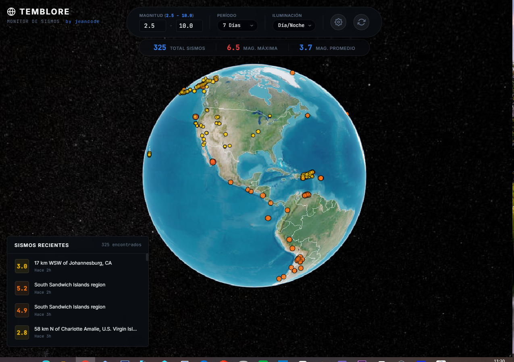

# 🌍 Temblore - Monitor de Sismos 3D



  

**Temblore** es una aplicación web interactiva que permite visualizar, filtrar y realizar un seguimiento en tiempo real de los sismos a nivel mundial en un espectacular globo 3D utilizando CesiumJS y la API oficial del USGS (United States Geological Survey).

## ✨ Características Principales

- **Globo 3D Interactivo**: Explora la Tierra en 3D con un control de cámara intuitivo y fluido.
- **Datos Oficiales del USGS**: Información sísmica en tiempo real alimentada directamente por el Servicio Geológico de Estados Unidos.
- **Filtros Avanzados**: 
  - Rango de Magnitud (Min/Max).
  - Periodo de tiempo (Última hora, Último día, Última semana, Último mes).
- **Seguimiento Automático**: Al activar el "Seguimiento Automático", el globo buscará sismos nuevos silenciosamente y volará de forma autónoma hacia el nuevo evento, simulando ondas expansivas.
- **Capas Geográficas (ESRI/CartoDB)**:
  - Nombres Geográficos (Ciudades y países).
  - Carreteras y Estados (Vías principales y fronteras políticas en alta resolución).
  - Fronteras Nacionales Simplificadas.
- **Interfaz Glassmorphism**: Un diseño moderno, oscuro y estético, libre de distracciones y enfocado en la experiencia espacial.
- **Panel Lateral de Detalles**: Información detallada del evento, magnitud precisa y enlace directo al reporte oficial del USGS.

## 🛠 Tecnologías Utilizadas

- **HTML5, CSS3, JavaScript (ES6)**: Tecnologías core web.
- **CesiumJS**: Motor de renderizado geoespacial 3D WebGL para el globo terráqueo.
- **USGS Earthquake Catalog API**: Fuente de datos sísmicos (GeoJSON).
- **ESRI MapServer & CartoDB**: Capas transparentes de tiles geográficos y carreteras.

## 🚀 Instalación y Uso Local

1. Clona este repositorio:
   ```bash
   git clone https://github.com/tu-usuario/temblore.git
   cd temblore
   ```

2. Sirve el proyecto usando cualquier servidor HTTP local. Si tienes Node.js instalado, puedes usar `npx serve`:
   ```bash
   npx serve . -p 3000
   ```

3. Abre tu navegador y dirígete a `http://localhost:3000`

## 💡 Cómo Usarlo

1. **Girar y Zoom**: Usa el clic izquierdo (o un dedo) para rotar el planeta, y la rueda del ratón (o pellizcar) para hacer zoom.
2. **Filtrar Sismos**: Utiliza el panel superior izquierdo para establecer el periodo y el rango de magnitud deseado.
3. **Ver Detalles**: Haz clic en cualquier punto del mapa (ondas sísmicas) o en un sismo de la lista inferior izquierda para que la cámara vuele hasta el lugar exacto y muestre los detalles en el panel inferior derecho.
4. **Menú de Configuración (Engranaje)**:
   - Alterna fronteras simples, carreteras complejas o nombres geográficos.
   - Activa el **Seguimiento Automático** para dejar el globo como un monitor en tiempo real.

## 📜 Licencia

Este proyecto está distribuido bajo la licencia MIT. Eres libre de usar, modificar y distribuir el código.

---
Creado con pasión por **jeancode**.
